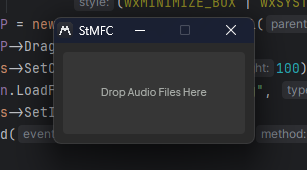

# __StMFC__ — Stereo to Mono Fast Converter.

---

**StMFC** is a free software that helps you to convert your stereo WAV-files to mono in purpose of saving memory.

Firstly it is utility for Ableton Live users, but **it can be used by everyone!**
I've made it just because Ableton Live has no ability to freeze and flatten to mono which is annoying for me.
Especially when I freeze my tuned vocals.

This little utility allows you to save _50%_ of your memory just because you'll store one channel on your drive instead of two.

## Get started
To get started, download the latest setup from [GitHub Releases](). Than install it and use.

To convert the file, just drop it into the utility's window *(works from Live's browser also)*, and then you'll get a file called **[OriginalName]_mono.wav**.
Then just replace an old audio with new one.
*PROGRAM DOES NOT REMOVE ORIGINAL FILES! YOU HAVE TO DELETE IT MANUALLY!*

There is no macOS version yet, so you have to build it by yourself.

## Build
For building from source, you need:
- C and C++ compilers (I used [MinGW-w64](https://winlibs.com/)),
- [CMake](https://cmake.org/) build system,
- [vcpkg](https://vcpkg.io/en/index.html) dependency manager,
- a LOOOOOT of time.

Install and prepare all of these and then follow the instruction:
1. Open a new terminal in the project directory.
2. Create CMake configuration: `cmake . -B"./build" -G"<GENERATOR>" -DCMAKE_TOOLCHAIN_FILE="<PATH_TO_VCPKG>/scripts/buildsystems/vcpkg.cmake" -DVCPKG_TARGET_TRIPLET=<SYSTEM_TRIPLET> -DVCPKG_HOST_TRIPLET=<SYSTEM_TRIPLET> -DCMAKE_BUILD_TYPE=RELEASE`

    - `<GENERATOR>` — your build system's files (type `cmake --help` to see generators available for your OS).
    
    - `<PATH_TO_VCPKG>` — path to your vcpkg root *(example: `-DCMAKE_TOOLCHAIN_FILE="D:/vcpkg/scripts/buildsystems/vcpkg.cmake"`)*.

    - `<SYSTEM_TRIPLET>` — what to build libraries for. To see all of these, type `vcpkg help triplets`.
3. Build program using `cmake --build ./build`.

Done! Build executable is located in **./build/bin** directory.

*If you have any issues on configuring, **use links provided by vcpkg in the command line.***